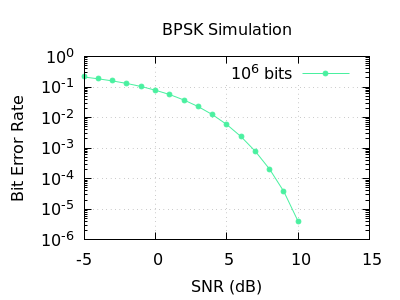

# Link Simulation — BPSK Digital Communications

A C++ simulation of a digital communications link implementing BPSK (Binary Phase Shift Keying) modulation. Generates random bit sequences, modulates them to IQ symbols, transmits through a simulated AWGN channel, demodulates, and computes Bit Error Rate (BER) across a sweep of SNR values. Output is a BER vs SNR curve written to CSV, suitable for plotting and link budget analysis.

## Project Structure

```
linksim/
├── CMakeLists.txt                  # top level build configuration
├── config.json                     # simulation parameters
├── src/
│   ├── CMakeLists.txt              # defines executable
│   ├── main.cpp                    # entry point, orchestrates pipeline
│   ├── BPSK.cpp                    # BPSK encode/decode implementation
│   ├── Channel.cpp                 # AWGN noise channel
│   ├── BitGenerator.cpp            # reproducible random bit generation
│   └── utils.cpp                   # config parsing, CSV output
├── include/
│   ├── BPSK.h                      # BPSK modulation policy struct
│   ├── Channel.h                   # channel class declaration
│   ├── BitGenerator.h              # bit generator class declaration
│   ├── LinkSimulation.h            # templated simulation orchestrator
│   ├── SimConfig.h                 # configuration struct
│   ├── utils.h                     # parseConfig, writeCSV declarations
│   └── nlohmann/json.hpp           # header-only JSON parser
├── results/                        # output dir (generated)
│   └── ber_results.csv             # simulation output (generated)
├── plot.gp                         # gnuplot script for BER curve
├── build.sh                        # CMake build script
├── check.sh                        # Cppcheck script
└── Makefile                        # convenience wrapper
```

## What It Demonstrates

### Digital Communications
- BPSK modulation — bit 0 maps to {+1, 0}, bit 1 maps to {-1, 0} in the IQ plane
- AWGN channel model — independent complex Gaussian noise on I and Q components
- Noise standard deviation derived from SNR: `σ = sqrt(1 / (2 * 10^(SNR_dB/10)))`
- Bit error rate computed as fraction of incorrectly decoded bits
- BER vs SNR curve — the standard figure of merit for a digital communications link

### Object-Oriented and Template Design
- Policy-based template design — `LinkSimulation<BPSK>` uses `BPSK` as a compile-time policy, enforcing a static interface contract (`encode`, `decode`, `BITS_PER_SYMBOL`)
- `static constexpr` member for compile-time constant `BITS_PER_SYMBOL`
- Clean separation of concerns — `BitGenerator`, `Channel`, and `LinkSimulation` each own a single responsibility
- `Channel` constructed once and reused across SNR sweep, rather than reinstantiated per point
- Reproducible bit generation — `BitGenerator` reseeds from stored seed before each `generate()` call, ensuring identical bit sequences across all SNR values

### C++17 Features
- `std::filesystem` for output directory creation
- Structured bindings (`const auto& [snr, ber]`) for readable pair iteration
- CTAD (Class Template Argument Deduction) for `std::pair`

### Build System and Dependencies
- Utilize vendor single-header `nlohmann/json.hpp` — no external dependencies, no build-time download
- `argc/argv` command line argument handling for config file path
- JSON config file drives all simulation parameters — no recompilation needed to change modulation, SNR range, or output path

### Error Handling and Validation
- Two-layer validation: `parseConfig` validates raw JSON input at the system boundary, constructors validate their own arguments independently
- `@throws` documented on all public interfaces, `@pre` on internal utility functions backed by `assert`
- `std::runtime_error` for I/O failures, `std::invalid_argument` for parameter validation

### Documentation
- Full Doxygen docstrings on all classes, structs, and public methods
- `@tparam` documents the `ModScheme` policy interface contract on `LinkSimulation`
- `@code` / `@endcode` usage examples in key docstrings

## Usage

### Configuration

Edit `config.json` to control the simulation:

```json
{
    "modulation":   "BPSK",
    "num_bits":     10000,
    "snr_range_db": { "min": -5.0, "max": 15.0, "step": 1.0 },
    "noise_model":  "AWGN",
    "seed":         42,
    "output_file":  "results/ber_results.csv"
}
```

| Field | Description |
|---|---|
| `modulation` | Modulation scheme. Currently `"BPSK"` only |
| `num_bits` | Bits simulated per SNR point. Higher = more accurate BER at low error rates |
| `snr_range_db` | SNR sweep range and step size in dB |
| `noise_model` | Noise model. Currently `"AWGN"` only |
| `seed` | RNG seed for reproducibility. Omit for a random seed |
| `output_file` | CSV output path. Directory is created if it does not exist |

### Building

#### Option 1: Using `cmake` directly

```bash
cmake -S. -Bbuild -DCMAKE_EXPORT_COMPILE_COMMANDS=ON
cmake --build build -j
```
#### Option 2: Using bash script (just the runs `cmake` comamnds in Option 1)

The build commands can also be run using the provided shell script,
```bash
./build.sh
```

#### Option 3: Using `make`

There is a Makefile in which `build` and `clean` are defined. The executable can be generated by running,
```bash
make
```

Executable is written to `bin/linksim`.

### Running

```bash
./bin/linksim config.json
```

### Plotting the BER Curve

Use any plotting software which reads CSV files. A `plot.gp` file is provided for plotting with a headless version of `gnuplot`.

Requires `gnuplot` and `gnuplot-nox`:

```bash
sudo apt install gnuplot-nox
gnuplot plot.gp
```

Produces `ber_curve.pdf` with BER plotted on a logarithmic axis against SNR.

### Running Cppcheck

```bash
cppcheck --project=build/compile_commands.json --suppress=missingIncludeSystem
```

### Cleaning

```bash
rm -rf build/ bin/
```

or

```bash
make clean
```

### Sample Output

Running with the default `config.json` only with `num_bits` changed so that 1,000,000 bits are used per point returns the following CSV:

```csv
snr_db,ber
-5.000000,0.213135
-4.000000,0.185949
-3.000000,0.158452
-2.000000,0.130699
-1.000000,0.103802
0.000000,0.078511
1.000000,0.056660
2.000000,0.037544
3.000000,0.022866
4.000000,0.012423
5.000000,0.005922
6.000000,0.002384
7.000000,0.000788
8.000000,0.000205
9.000000,0.000038
10.000000,0.000004
11.000000,0.000000
...
15.000000,0.000000
```

BER curve plotted using a similar `plot.gp` file,



BER falls steeply with increasing SNR — the characteristic waterfall curve of a digital communications link. At 0 dB SNR roughly 8% of bits are decoded incorrectly. By 10 dB this drops to near zero.

## Additional Dependencies

- nlohmann/json (vendored as `include/nlohmann/json.hpp`) already included
- gnuplot-nox (optional, for plotting)

## Scope and Standards

This project is written in the context of simulation and ground support software, where standard C++ features including exceptions, STL containers, and dynamic memory allocation are appropriate. It does not follow safety-critical coding standards such as JSF++ or MISRA C++, which apply to flight-certified and embedded systems.

## Key C++ Concepts Referenced

- Policy-based template design with `static constexpr` interface contracts
- `std::filesystem` for portable directory and path operations
- Structured bindings (`auto& [key, value]`)
- CTAD — Class Template Argument Deduction
- `mutable` member variables for logically-const methods with stateful RNG
- Rule of zero — no explicit destructors, copy/move operators needed
- Two-layer validation: boundary input validation plus constructor-level defensive checks
- `argc/argv` command line argument handling
- JSON config file parsing with nlohmann/json
- `std::ofstream` with `std::fixed` and `std::setprecision` for formatted CSV output
- Doxygen `@tparam`, `@pre`, `@code` / `@endcode` tags
